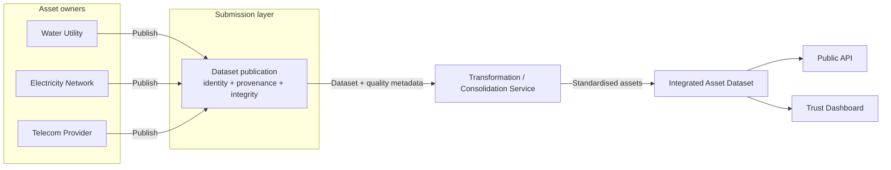
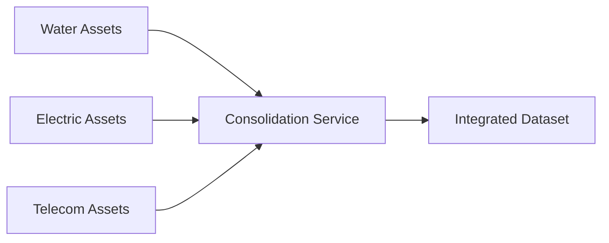
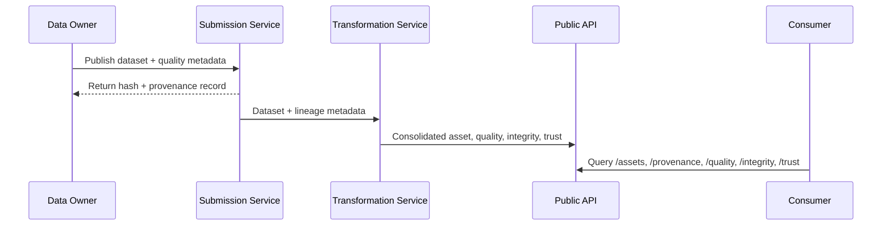

# Demonstrator Brief: Integrity, Provenance, Trust and Data Quality for Federated Asset Data

## Purpose

Create a lightweight demonstrator that shows how Integrity, Provenance, Trust (IPT) and Data Quality (DQ) concepts can be applied in a federated asset data ecosystem.

The demonstrator illustrates how multiple data owners can publish data, how data can be transformed and combined, and how consumers can access both the resulting data and evidence relating to:

- who supplied it
- when it was supplied
- how it was transformed
- whether it has been altered
- the quality of the source data
- whether it can be trusted for a given purpose

The demonstrator is intentionally technology-agnostic and focused on concepts rather than production-grade implementation.

## Context and scope

This concept aligns with broader geospatial and data governance thinking around trusted data exchange and traceability. Relevant standards and initiatives include:

- [OGC Standards](https://www.ogc.org/standards/)
- [OGC API Features](https://www.ogc.org/standard/ogcapi-features/)
- [OGC API - Records](https://www.ogc.org/standard/ogcapi-records/)

## Related documentation

- [Extension overview](./EXTENSION.md)

## Demonstration scenario

Three independent asset owners publish datasets that are later consolidated into a single asset view.

| Asset owner | Dataset | Example attributes | Quality metadata |
| --- | --- | --- | --- |
| Water Utility | Water Mains | Asset ID, Pipe Material, Diameter, Installation Date, Geometry | Positional Accuracy: ±250mm; Completeness: 95%; Last Surveyed: 2024 |
| Electricity Network | High Voltage Cables | Asset ID, Voltage, Installation Date, Geometry | Positional Accuracy: ±500mm; Completeness: 90%; Last Surveyed: 2021 |
| Telecommunications Provider | Fibre Ducts | Asset ID, Duct Type, Capacity, Geometry | Positional Accuracy: ±100mm; Completeness: 98%; Last Surveyed: 2025 |

## Demonstrated concepts

### 1. Identity

Every asset owner receives a unique digital identity.

Examples:

- `water-company-01`
- `power-network-01`
- `telecom-provider-01`

The demonstrator should show that published datasets can be linked back to a verified source.

### 2. Provenance

Every dataset carries provenance information.

Example JSON:

```json
{
  "owner": "water-company-01",
  "created": "2026-01-12",
  "version": "1.0"
}
```

The demonstrator should preserve provenance through all subsequent processing.

### 3. Integrity

When datasets are submitted:

- generate a hash
- store the hash alongside metadata

Example JSON:

```json
{
  "sha256": "abc123..."
}
```

Users should be able to verify that a dataset has not changed since publication.

### 4. Data quality

A standard quality model should accompany every dataset.

Example JSON:

```json
{
  "accuracy": "250mm",
  "completeness": 95,
  "confidence": "high"
}
```

Quality information must remain accessible after transformation.

## High-level architecture



## Transformation service

Implement a simple processing service:

### Asset Consolidation Service

Inputs:

- water assets
- electricity assets
- telecom assets

Processing:

- convert all datasets into a common model
- standardise attribute names
- merge into a single dataset

Example mapping:

- `water-main` -> `underground-asset`
- `hv-cable` -> `underground-asset`
- `fibre-duct` -> `underground-asset`

Output:

- Integrated Asset Dataset

### Provenance recording

The processing service should automatically generate lineage metadata.

Example JSON:

```json
{
  "activity": "asset-consolidation",
  "inputs": [
    "water-dataset-v1",
    "electricity-dataset-v1",
    "telecom-dataset-v1"
  ],
  "output": "integrated-assets-v1"
}
```

The user should be able to inspect the lineage chain from source dataset to final dataset.

## Trust scoring

Generate a simple trust score using:

- source verification
- integrity check
- data quality
- data freshness

Example output:

```json
{
  "trustScore": 87,
  "rating": "High"
}
```

This score is illustrative and intended to demonstrate how trust information may be surfaced to consumers.

## Public API

Expose a small REST API.

### Asset endpoint

`GET /assets`

Returns consolidated assets.

### Provenance endpoint

`GET /assets/{id}/provenance`

Returns:

```json
{
  "owner": "water-company-01",
  "suppliedDate": "2026-01-12",
  "transformation": [
    "standardisation",
    "consolidation"
  ]
}
```

### Quality endpoint

`GET /assets/{id}/quality`

Returns quality metadata.

### Integrity endpoint

`GET /assets/{id}/integrity`

Returns:

```json
{
  "verified": true,
  "hash": "abc123..."
}
```

### Trust endpoint

`GET /assets/{id}/trust`

Returns:

```json
{
  "score": 87,
  "rating": "High"
}
```

## Suggested user interface

A simple web application could show:

- asset catalogue
- asset owner
- dataset
- asset count
- trust score
- source organisation
- quality metrics
- integrity status
- provenance chain
- processing view

### Visual flow



### Trust dashboard

For each dataset, the interface can display:

- ✓ Identity Verified
- ✓ Integrity Verified
- ✓ Provenance Available
- ✓ Quality Metadata Present
- Trust Rating: High

## Sequence view



## Success criteria

The demonstrator successfully proves that:

- multiple independent asset owners can publish data
- data ownership can be verified
- integrity checks detect tampering
- provenance survives transformation
- data quality metadata can be standardised and exposed
- trust indicators can be calculated and presented to users
- consumers can access data and trust evidence through APIs

## Expected outcome

The demonstrator should provide a tangible example of how an asset data platform could evolve from simply publishing datasets to delivering verifiable, traceable, quality-assured and trustworthy data products. It brings together the concepts from OGC IPT and Data Quality initiatives in a way that is easy for stakeholders to understand and evaluate.

## Related resources

- [OGC Standards](https://www.ogc.org/standards/)
- [OGC API Features](https://www.ogc.org/standard/ogcapi-features/)
- [OGC API - Records](https://www.ogc.org/standard/ogcapi-records/)
- [Open Geospatial Consortium](https://www.ogc.org/)
